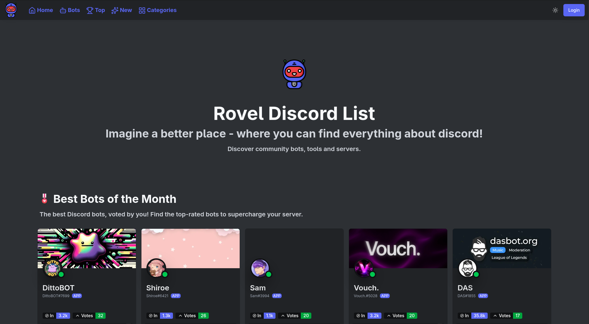
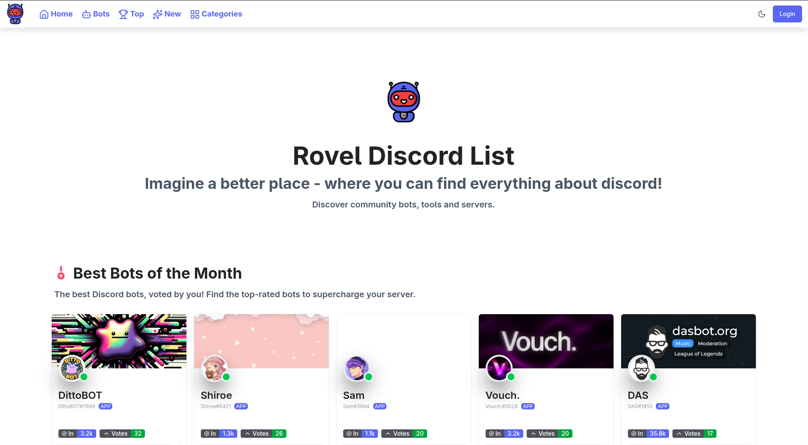
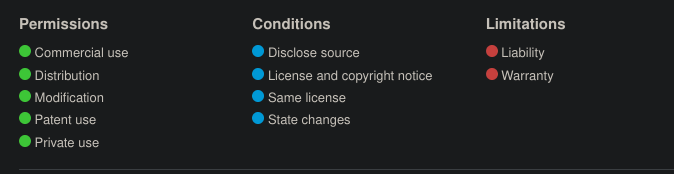

<div align='center'>
  
  <h1>Rovel Discord List</h1>
  <h3>The Ultimate Discord List for Emojis, Users, Servers & Bots!</h3>
</div>

---

### Dark Theme



### Light Theme



---

## License Notice



This project is licensed under the GNU GPLv3 License. You can view the license [here](LICENSE).
Permissions of this strong copyleft license are conditioned on making available complete source code of licensed works and modifications, which include larger works using a licensed work, under the same license. Copyright and license notices must be preserved. Contributors provide an express grant of patent rights. When a modified version is used to provide a service over a network, the complete source code of the modified version must be made available.

---

## Self Hosting

We use Astro to build the website. To run the website locally, you need to have Node.js installed on your machine. If you don't have Node.js installed, you can download it from [here](https://nodejs.org/). Alternatively, feel free to use [Bun](https://bun.sh) to run the website locally. Our current project is configured to build for Netlify, if you want to build for Vercel, you can change the configuration in the `astro.config.js` file. The same goes for other platforms.

### Running the website locally

1. Clone the repository

   ```bash
   git clone https://github.com/rovelstars/discord-list
   ```

2. Change the directory to the project directory

   ```bash
   cd discord-list
   ```

   At this point, you should fill in the required environment variables in the `.env` file. You can copy the `.env.example` file and rename it to `.env`.

3. Install the dependencies

   ```bash
   npm install # or bun install if you are using Bun
   ```

4. Run the website

   ```bash
   npm run dev # or bun dev if you are using Bun
   ```

---

This project is kept open source so we are transparent in our services, as well as interested people can contribute to it.

> Thank you for your time, love and support that make this project possible!

# Stargazers

[](https://github.com/rovelstars/discord-list/stargazers)

# Forkers

[](https://github.com/rovelstars/discord-list/network/members)
