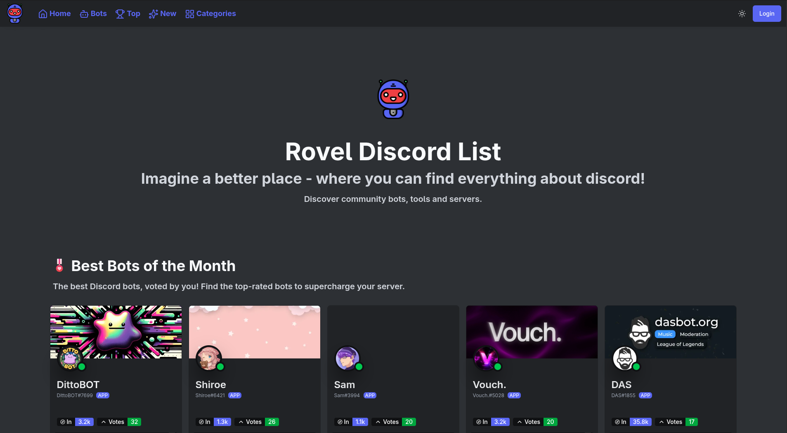
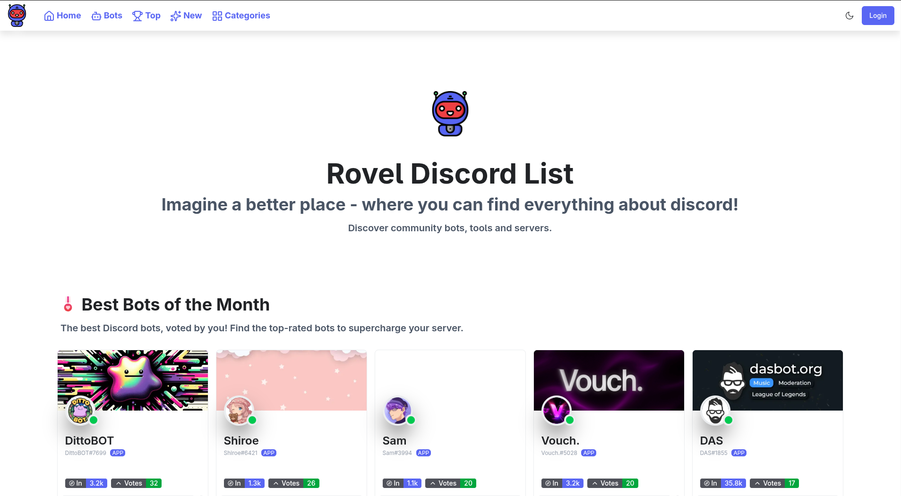
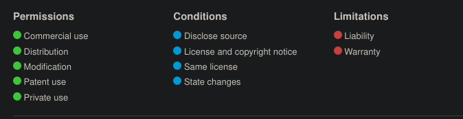

<div align='center'>
  
  <h1>Rovel Discord List</h1>
  <h3>Imagine a better place - where you can find everything about discord!</h3>
</div>

---

### Dark Theme



### Light Theme



---

### Looking for the old version?

It's publicly archived at [rovelstars/discord-list-old](https://github.com/rovelstars/discord-list-old).

---

## License Notice



This project is licensed under the GNU GPLv3 License. You can view the license [here](LICENSE).
Permissions of this strong copyleft license are conditioned on making available complete source code of licensed works and modifications, which include larger works using a licensed work, under the same license. Copyright and license notices must be preserved. Contributors provide an express grant of patent rights. When a modified version is used to provide a service over a network, the complete source code of the modified version must be made available.

---

## Self Hosting

We use [SvelteKit](https://svelte.dev/docs/kit) to build the website, with [Turso](https://turso.tech) (libSQL) as the database and [Drizzle ORM](https://orm.drizzle.team) for queries. To run the website locally you need [Node.js](https://nodejs.org/) or [Bun](https://bun.sh) installed. The project is configured to deploy on Netlify.

### Running the website locally

1. Clone the repository

   ```bash
   git clone https://github.com/rovelstars/discord-list
   ```

2. Change into the project directory

   ```bash
   cd discord-list
   ```

3. Copy the example environment file and fill in your values

   ```bash
   cp .env.example .env
   ```

   See the [Environment Variables](#environment-variables) section below for a description of every variable.

4. Install the dependencies

   ```bash
   bun install   # or: npm install
   ```

5. Start the development server

   ```bash
   bun dev       # or: npm run dev
   ```

   The site will be available at `http://localhost:5173` by default.

### Building for production

```bash
bun run build   # or: npm run build
```

---

## Environment Variables

Copy `.env.example` to `.env` and fill in the values. The table below describes every variable.

| Variable | Required | Description |
|---|---|---|
| `ASTRO_DB_REMOTE_URL` | Yes | Your Turso database URL (`libsql://...`) |
| `ASTRO_DB_APP_TOKEN` | Yes | Turso read-write auth token |
| `DISCORD_BOT_ID` | Yes | Your Discord application/bot client ID |
| `DISCORD_GUILD_ID` | Yes | Discord server ID used for admin & logging |
| `DISCORD_PUBLIC_KEY` | Yes | Discord application public key |
| `DISCORD_SECRET` | Yes | Discord OAuth2 client secret |
| `DISCORD_TOKEN` | Yes | Discord Bot token |
| `SELFBOT_TOKEN` | Yes | Legacy token for internal bot-info lookups |
| `DOMAIN` | Yes | Full origin URL of this deployment (no trailing slash) |
| `SITE_URL` | Yes | Deployed site origin — used by the Netlify scheduled CDN-refresh function |
| `HTTPS` | Yes | `true` in production, `false` locally |
| `MODE` | Yes | `development` or `production` |
| `INTERNAL_SECRET` | Yes | Shared secret authenticating calls from the scheduled function to internal API routes. Generate with `openssl rand -hex 32` |
| `SECRET` | Yes | Session / cookie signing secret |
| `BOT_PREFIX` | No | Admin bot command prefix (default `RDL!`) |
| `CONSOLE_LOG` | No | Discord webhook URL for console/error logs |
| `WEBHOOK` | No | Discord webhook URL for bot/server event logs |
| `LOGS_CHANNEL_ID` | No | Discord channel ID for approval/removal logs |
| `FAILED_DMS_LOGS_CHANNEL_ID` | No | Discord channel ID for failed DM logs |
| `WEBLOG_API` | No | Enable API-based web logging (`true`/`false`) |
| `WEBLOG_CONSOLE` | No | Enable console-based web logging (`true`/`false`) |
| `MONGO_DB` | No | MongoDB connection string (legacy modules) |
| `SENTRY` | No | Sentry DSN for error tracking |
| `TOPTOKEN` | No | Top.gg API token(s) for vote syncing, separated by ` \| ` |
| `VOIDTOKEN` | No | Void Bot List API token |

---

## Periodic CDN Refresh

Discord CDN attachment URLs (used as bot background images) expire after ~24 hours. This project includes a Netlify Scheduled Function that automatically refreshes them every 12 hours with **zero site downtime**:

- `netlify/functions/scheduled-cdn-refresh.mts` — runs on cron `0 */12 * * *`, calls the internal endpoint below.
- `src/routes/api/internals/refresh-cdn-bgs/+server.ts` — fetches only `id`+`bg` columns, classifies URLs in memory (no CDN fetches), sends expired ones to Discord's `POST /attachments/refresh-urls` API in batches of 50, and writes back only the rows that actually changed.

Make sure `INTERNAL_SECRET`, `SITE_URL`, and `DISCORD_TOKEN` are set in your Netlify environment variables for this to work.

---

This project is kept open source so we are transparent in our services, and so that interested people can contribute to it.

> Thank you for your time, love and support that make this project possible!

# Stargazers

[](https://github.com/rovelstars/discord-list/stargazers)

# Forkers

[](https://github.com/rovelstars/discord-list/network/members)